

        

        

        

        

        

        

        

        

        

build 

---

        

        

        

        

        

        

        

        

        

스마트 멀티탭에 관한 연구

Research on Smart Multi-Tap

## 발표자

<h6 style="padding-left: 70px;"> 박준영</h4>

  

---

📋  목차 

    <h2 class="slowup" style="--order: 2.2;">서론</h2>
    <ul>
        <li class="slowup" style="--order: 2.4;">연구 배경 및 목적</li>
        <li class="slowup" style="--order: 2.6;">기존 제품 분석</li>
    </ul>
    <h2 class="slowup" style="--order: 2.8;">설계 및 구현</h2>
    <ul>
        <li class="slowup" style="--order: 3;">소프트웨어 및 하드웨어</li>
        <li class="slowup" style="--order: 3.2;">주요 기능</li>
    </ul>

    <h2 class="slowup" style="--order: 3.6;">실험 및 결과</h2>
    <ul>
        <li class="slowup" style="--order: 3.8;">실험 분석 및 해결 방안</li>
        

    </ul>
    <h2 class="slowup" style="--order: 4;">고찰 및 결론</h2>
    <ul>
        <li class="slowup" style="--order: 4.2;">연구 결과 분석</li>
        <li class="slowup" style="--order: 4.4;">한계점 및 개선 방안</li>
        <li class="slowup" style="--order: 4.6;">결론</li>
    </ul>

  

---

        

        

        

        

        

        

        

        

        

    <h1 class="sub1 slowup" style="--order: 1.2;"> 서론 </h1>
    <ul>
        <li class="slowup" style="--order: 1.7;">연구 배경 및 목적</li>
        <li class="slowup" style="--order: 2.2;">기존 제품 분석</li>
    </ul>

  

---

🚀  서론  🔹 <strong>연구 배경 및 목적</strong>

    <h3 class="slowup" style="--order: 2.2;">연구배경</h3>
    <ul>
        <li class="slowup" style="--order: 2.4;">전기는 현대 사회에서의 필수적인 요소</li>
        <li class="slowup" style="--order: 2.6;">전체 화재의 약 30%가 전기화재</li>
        <li class="slowup" style="--order: 2.8;">멀티탭은 가까운 전기기기 중 하나</li>
    </ul>
    <h3 class="slowup" style="--order: 3.3;">목적</h3>
    <ul>
        <li class="slowup" style="--order: 3.5;">조금 더 개선된 멀티탭 제작</li>
    </ul>

    

        

            <h3>이미지</h3>
        

        

            

                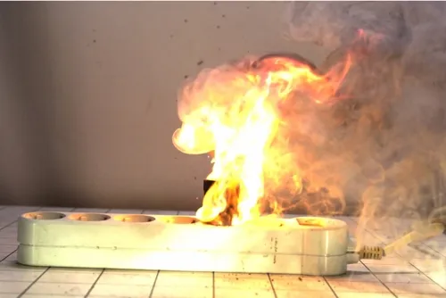
            

            

                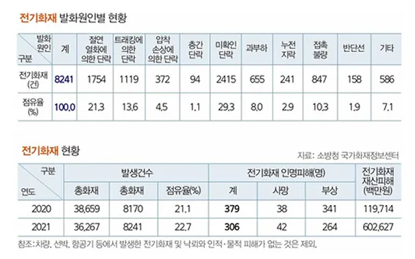
            

        

    

  

---

🚀  서론  🔹 <strong>기존 제품 분석</strong>

 

 
<h3 class="slowup" style="--order: 2.2;"> 기존 제품 비교 </h3>

    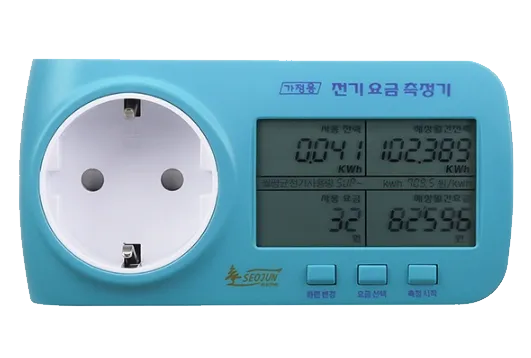
    전기 요금 측정기
    <strong>콘센트</strong>→<strong>측정기</strong>→<strong>기기</strong>순 연결, 1구 사용, 리드선 X

    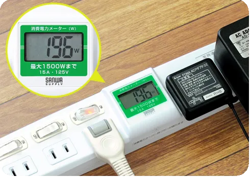
    전력계 멀티탭
    전력 출력, <strong>IoT</strong> 및 <strong>Wifi 통신</strong>으로 원격 계측 및 제어 가능

    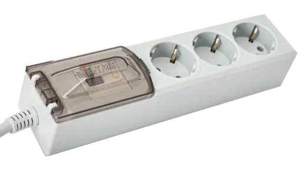
    차단기 멀티탭
    <strong>과전류</strong> 발생 시 멀티탭 <strong>전체 차단</strong>

    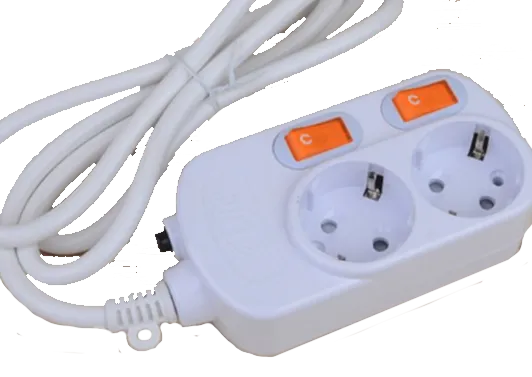
    개별전원 멀티탭
    코드 연결 후 미 사용 시 <strong>개별 차단</strong> 가능

 

  

---

🚀  서론  🔹 <strong>기존 제품 분석</strong>

 

 
<h3 class="slowup" style="--order: 2.2;"> 개선 가능한 부분 </h3>

    전기 요금 측정기
    멀티탭 내장 시, <strong>위치 제한 해소</strong>  및  <strong>편의성 향상</strong> 가능

    전력계 멀티탭
    비싼IoT 및 WIFI 모듈 제외 <strong>Display</strong>, <strong>LED</strong>, <strong>Buzzer</strong>로 대체해 <strong>가성비</strong>, <strong>시인성</strong> 향상

    차단기 멀티탭
    과전류 시 전체가 아닌 <strong>개별 차단</strong>으로 <strong>사용 편의성</strong> 향상

    개별전원 멀티탭
    스위치 대신 버튼으로 변경 코드를 빼면 <strong>자동 제어</strong>를 해 <strong>편의성</strong>, <strong>안전성</strong> 향상

<h6 class="slowup" style="--order: 3.5;"> ⭐편의성 및 안전성  위주의 <strong>안전 시스템</strong>을 갖춘 멀티탭을 목표</h6>

 

  

---

        

        

        

        

        

        

        

        

        

    <h1 class="sub2 slowup"  style="--order: 1.2;"> 설계 및 구현 </h1>
    <ul>
        <li class="slowup" style="--order: 1.7;">소프트웨어 및 하드웨어</li>
        <li class="slowup" style="--order: 2.2;">주요 기능</li>
    </ul>

  

---

🛠️  설계 및 구현  🔹 <strong>소프트웨어 및 하드웨어</strong>

    <h3 class="slowup" style="--order: 2.2;">하드웨어 구성</h3>
    <ul>
        <li class="slowup" style="--order: 2.7;">🕹️ 아두이노 ATMega 2560</li>
        <li class="slowup" style="--order: 2.9;">🕹️ 릴레이 SRD-05VDC-SL-C</li>
        <li class="slowup" style="--order: 3.1;">⚙️ 전압 센서 ZMPT101B</li>
        <li class="slowup" style="--order: 3.3;">⚙️ 전류 센서 ACS712 20A</li>
        <li class="slowup" style="--order: 3.5;">⚙️ 감압 센서 FSR</li>
        <li class="slowup" style="--order: 3.7;">📡 블루투스 모듈 HM-10</li>
        <li class="slowup" style="--order: 3.9;">📡 디스플레이 TFT LCD ST7735</li>
        <li class="slowup" style="--order: 4.1;">📡 LED, 부저 RGB, 압전 부저</li>
    </ul>

    

        

            <h3>내부 구조</h3>
        

        

            
        

    

  

---

🛠️  설계 및 구현  🔹 <strong>소프트웨어 및 하드웨어</strong>

    <h3 class="slowup" style="--order: 2.2;">소프트웨어 구성</h3>
    <ul>
        <li class="slowup" style="--order: 2.7;">⚙️ 센서 데이터 수집 및 샘플링 <h5>Analog > Digital 변환</h5></li>
        <li class="slowup" style="--order: 2.9;">⚙️ 전력, 전압, 전류 계산 <h5>Digital값 보정 후 반환</h5></li>
        <li class="slowup" style="--order: 3.1;">🕹️ 데이터 수집 결과 분석</li>
        <li class="slowup" style="--order: 3.3;">🕹️ 과전류 개별 차단 및 경고 시스템 <h5>부저&LED 경고</h5></li>
        <li class="slowup" style="--order: 3.5;">📡 디스플레이 및 블루투스 출력 <h5>디스플레이&웹 출력</h5></li>
    </ul>

    

        

            <h3>알고리즘 흐름도</h3>
        

        

            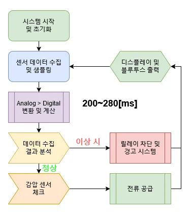
        

    

  

---

🛠️  설계 및 구현  🔹 <strong>주요 기능</strong>

<h3 class="slowup" style="--order: 2.2"> 💻 전력 모니터링 기능</h3>

<h4 class="slowup" style="--order: 2.7">디스플레이</h4>
<ul>
    <li class="slowup" style="--order: 2.9">1초마다 전력, 전압, 전류 정보 제공</li>
    <li class="slowup" style="--order: 3.1">화면보호기 기능 [10s]</li>
</ul>

<h4 class="slowup" style="--order: 3.6">웹페이지</h4>
<ul>
    <li class="slowup" style="--order: 3.8">예측 일간, 주간, 월간 소비 전력량 제공</li>
    <li class="slowup" style="--order: 3.8">원격 제어 가능</li>
</ul>

    

        

            <h3>전력 모니터링</h3>
        

        

            

                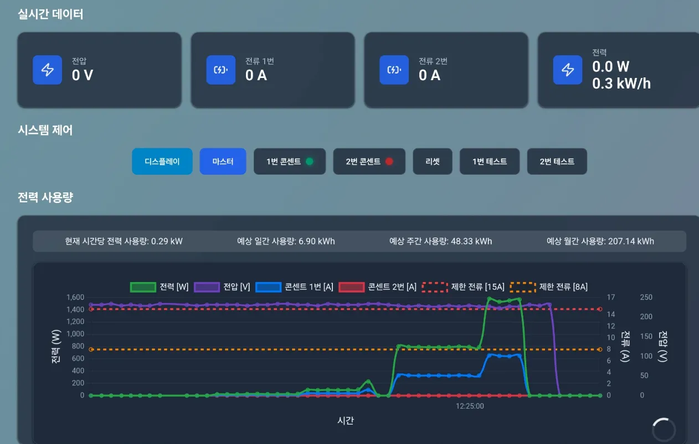
            

            

                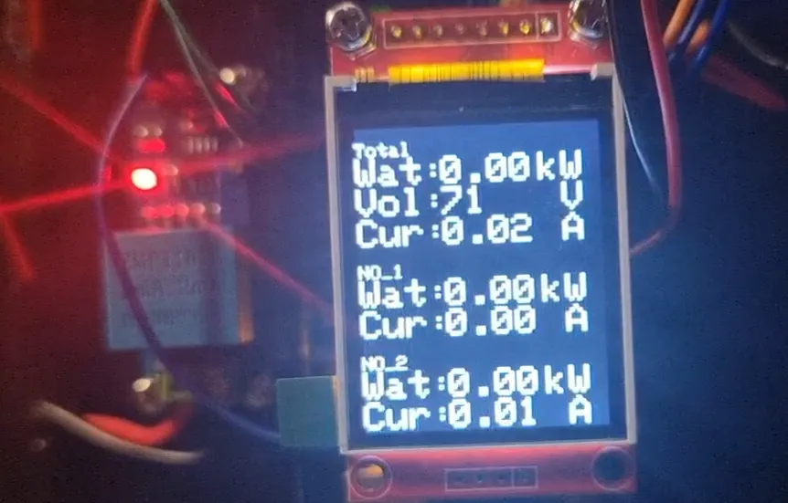
            

        

    

  

---

🛠️  설계 및 구현  🔹 <strong>주요 기능</strong>

<h3 class="slowup" style="--order: 2.2"> ⚡ 과전류 개별 차단 및 경고 기능</h3>

<h4 class="slowup" style="--order: 2.7">과전류 차단</h4>
<ul>
    <li class="slowup" style="--order: 2.9">총 15A, 개별 8A 허용 전류 [240ms]</li>
    <li class="slowup" style="--order: 3.1">콘센트 당 2개의 릴레이로 개별 차단</li>
</ul>

<h4 class="slowup" style="--order: 3.6">경고</h4>
<ul>
    <li class="slowup" style="--order: 3.8">이상 시 부저 동작</li>
    <li class="slowup" style="--order: 4">이상/정상/꺼짐 시 R/G/B LED 점등</li>
</ul>

    

        

            <h3>과전류 차단</h3>
        

        

            
        

    

  

---

🛠️  설계 및 구현  🔹 <strong>주요 기능</strong>

<h3 class="slowup" style="--order: 2.2"> 🔌 코드 감응형 차단 기능</h3>

<h4 class="slowup" style="--order: 2.7">코드 감응</h4>
<ul>
    <li class="slowup" style="--order: 2.9">FSR 센서 기반</li>
    <li class="slowup" style="--order: 3.1">코드가 삽입된 경우 ON/OFF 가능</li>
    <li class="slowup" style="--order: 3.3">코드가 삽입이 안된 경우 OFF만 가능</li>
</ul>

    

        

            <h3>코드 감응형 차단</h3>
        

        

            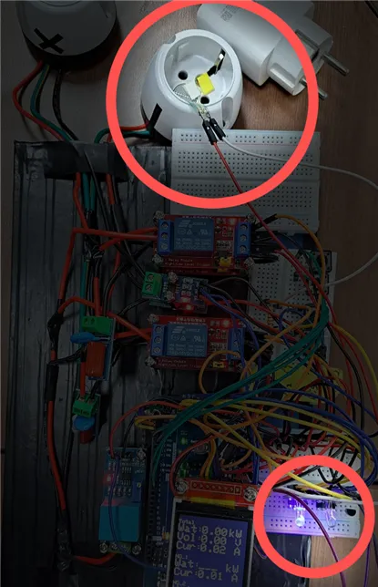
            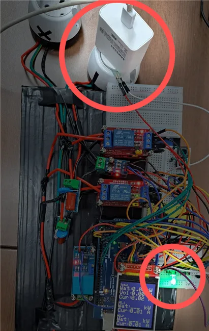
        

    

  

---

        

        

        

        

        

        

        

        

        

    <h1 class="sub3 slowup" style="--order: 1.2;"> 실험 및 결과 </h1>
    <ul>
        <li class="slowup" style="--order: 2.2;">실험 분석 및 해결 방안</li>
    </ul>

  

---

🧪  실험 및 결과  🔹 <strong>실험 분석 및 해결 방안</strong>

<h3 class="slowup" style="--order: 2.2"> 🚫 릴레이 차단 테스트</h3>

<h4 class="slowup" style="--order: 2.7">실험 목적</h4>
<ul>
    <li class="slowup" style="--order: 2.9">220V 제어 여부 확인</li>
    <li class="slowup" style="--order: 3.1">동작 확인</li>
</ul>

<h4 class="slowup" style="--order: 3.6">실험 결과</h4>
<ul>
    <li class="slowup" style="--order: 3.8">✅ 220V 제어 성공</li>
    <li class="slowup" style="--order: 4">❌ 아두이노 OFF</li>
</ul>

    

        

            <h3>실험 과정&데이터</h3>
        

        

            

                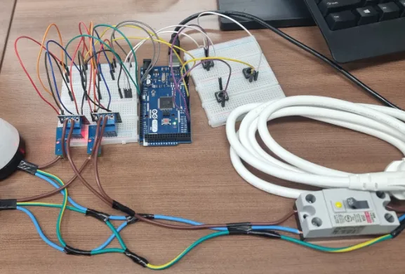
            

            

                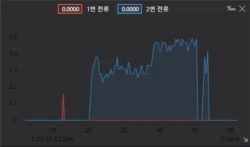
            

        

    

  

---

🧪  실험 및 결과  🔹 <strong>실험 분석 및 해결 방안</strong>

<h3 class="slowup" style="--order: 2.2"> 🚫 릴레이 차단 테스트</h3>

<h4 class="slowup" style="--order: 2.7"><strong>아두이노 OFF</strong> 원인 분석</h4>
<ul>
    <li class="slowup" style="--order: 2.9">릴레이 제어 시 서지 전류 유입</li>
    <li class="slowup" style="--order: 3.1">서지 전류로 인해 아두이노 OFF</li>
</ul>

<h4 class="slowup" style="--order: 3.6">해결 방안</h4>
<ul>
    <li class="slowup" style="--order: 3.8">서지 전류를 위해 RC 스너버 설치</li>
    <li class="slowup" style="--order: 4">RC 스너버 설치 후 문제 해결</li>
</ul>

    

        

            <h3>서지 데이터&RC 스너버</h3>
        

        

            

                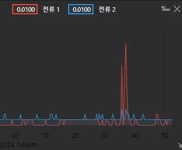
            

            

                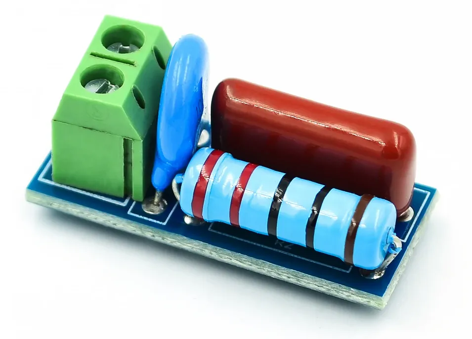
            

        

    

  

---

🧪  실험 및 결과  🔹 <strong>실험 분석 및 해결 방안</strong>

<h3 class="slowup" style="--order: 2.2"> ⚡ 전압, 전류 측정 테스트</h3>

<h4 class="slowup" style="--order: 2.7">실험 목적</h4>
<ul>
    <li class="slowup" style="--order: 2.9">전압 측정값 정확도 확인</li>
    <li class="slowup" style="--order: 3.1">기타 문제사항 확인</li>
</ul>

<h4 class="slowup" style="--order: 3.6">실험 결과</h4>
<ul>
    <li class="slowup" style="--order: 3.8">✅ 측정 성공</li>
    <li class="slowup" style="--order: 4">⚠️ 2~5V 오차 발생</li>
</ul>

    

        

            <h3>[15EA] 전압 측정 데이터</h3>
        

        

            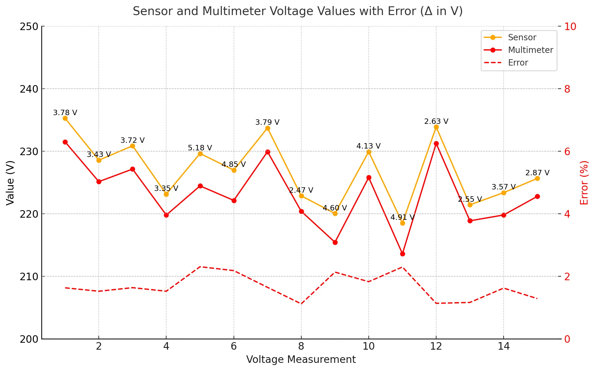
        

    

  

---

🧪  실험 및 결과  🔹 <strong>실험 분석 및 해결 방안</strong>

<h3 class="slowup" style="--order: 2.2"> ⚡ 전압, 전류 측정 테스트</h3>

<h4 class="slowup" style="--order: 2.7">실험 목적</h4>
<ul>
    <li class="slowup" style="--order: 2.9">전류 측정값 정확도 확인</li>
    <li class="slowup" style="--order: 3.1">기타 문제사항 확인</li>
</ul>

<h4 class="slowup" style="--order: 3.6">실험 결과</h4>
<ul>
    <li class="slowup" style="--order: 3.8">✅ 측정 성공</li>
    <li class="slowup" style="--order: 4">⚠️ 100~180mA 오차 발생</li>
</ul>

    

        

            <h3>[10EA] 전류 측정 데이터</h3>
        

        

            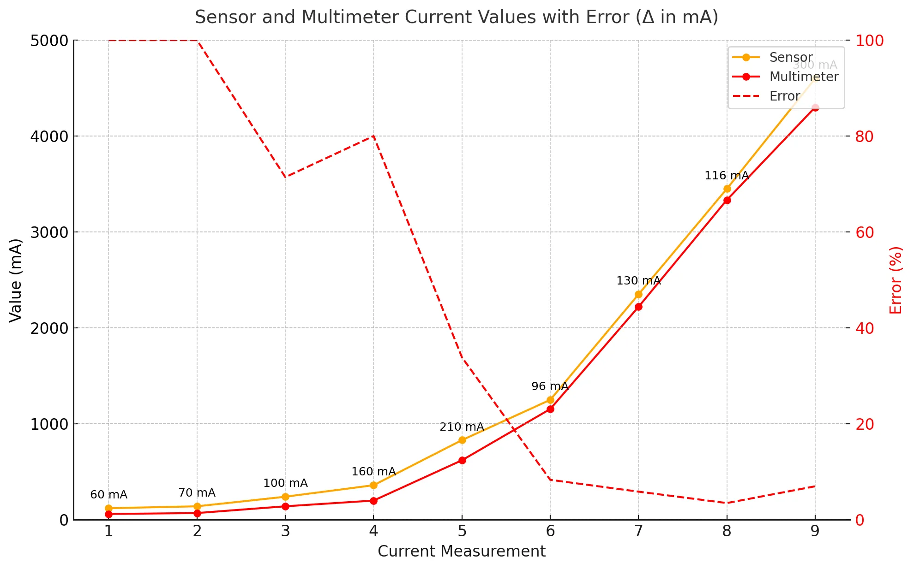
        

    

  

---

🧪  실험 및 결과  🔹 <strong>실험 분석 및 해결 방안</strong>

<h3 class="slowup" style="--order: 2.2"> ⚡ 전압, 전류 측정 테스트</h3>

<h4 class="slowup" style="--order: 2.7"><strong>오차</strong> 원인 분석</h4>
<ul>
    <li class="slowup" style="--order: 2.9">Analog > Digital 변환식 문제</li>
    <li class="slowup" style="--order: 3.1">OFFSET</li>
</ul>

<h4 class="slowup" style="--order: 3.6">해결 방안</h4>
<ul>
    <li class="slowup" style="--order: 3.8">OFFSET 보정 추가</li>
    <li class="slowup" style="--order: 4">구간 별 보정 및 샘플링 추가</li>
</ul>

    

        

            <h3>OFFSET</h3>
        

        

            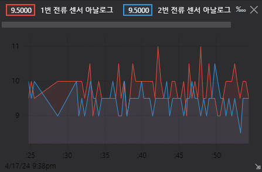
        

    

  

---

🧪  실험 및 결과  🔹 <strong>실험 분석 및 해결 방안</strong>

<h3 class="slowup" style="--order: 2.2"> ⚡ 과전류 감지 및 차단 테스트</h3>

<h4 class="slowup" style="--order: 2.7">실험 목적</h4>
<ul>
    <li class="slowup" style="--order: 2.9">과전류 차단 여부 확인</li>
    <li class="slowup" style="--order: 3.1">소요 시간 확인</li>
</ul>

<h4 class="slowup" style="--order: 3.6">실험 결과</h4>
<ul>
    <li class="slowup" style="--order: 3.8">✅ 과전류 차단 성공</li>
    <li class="slowup" style="--order: 4">❌ 차단 시간 [380ms]</li>
</ul>

    

        

            <h3>과전류 실험 과정</h3>
        

        

            

                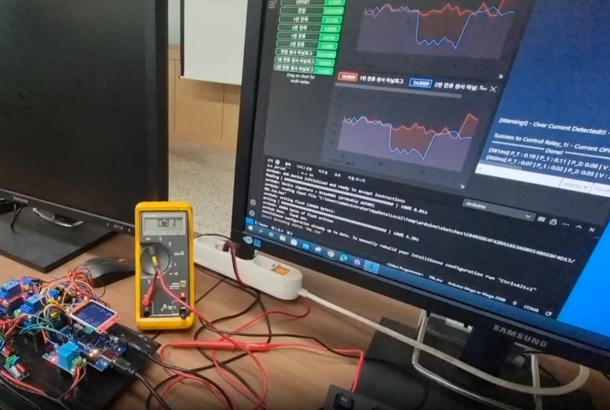
            

            

                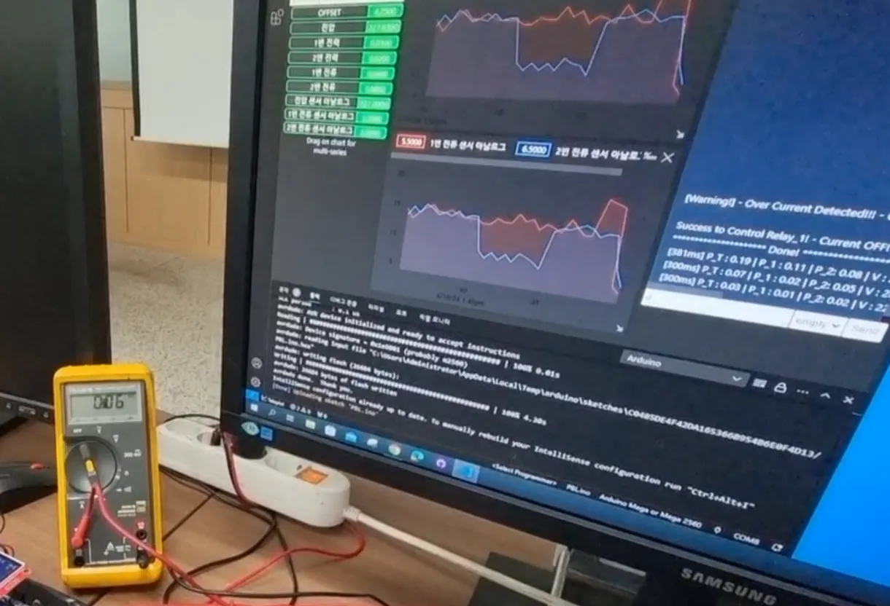
            

        

    

  

---

🧪  실험 및 결과  🔹 <strong>실험 분석 및 해결 방안</strong>

<h3 class="slowup" style="--order: 2.2"> ⚡ 과전류 감지 및 차단 테스트</h3>

<h4 class="slowup" style="--order: 2.7"><strong>차단 지연</strong> 원인 분석</h4>
<ul>
    <li class="slowup" style="--order: 2.9">싱글 스레드 기반 MCU</li>
    <li class="slowup" style="--order: 3.1">디스플레이 출력 시 지연 발생</li>
</ul>

<h4 class="slowup" style="--order: 3.6">해결 방안</h4>
<ul>
    <li class="slowup" style="--order: 3.8">화면보호기 도입</li>
    <li class="slowup" style="--order: 4">이전과 동일한 값 출력 안하게 코드 최적화</li>
</ul>

    

        

            <h3>코드 최적화 전&후</h3>
        

        

            
            
        

    

  

---

🧪  실험 및 결과  🔹 <strong>실험 분석 및 해결 방안</strong>

<h3 class="slowup" style="--order: 2.2"> 🚨 경고 시스템 구현 테스트</h3>

<h4 class="slowup" style="--order: 2.7">실험 목적</h4>
<ul>
    <li class="slowup" style="--order: 2.9">LED 및 부저 동작 확인</li>
    <li class="slowup" style="--order: 3.1">기타 문제사항 확인</li>
</ul>

<h4 class="slowup" style="--order: 3.6">실험 결과</h4>
<ul>
    <li class="slowup" style="--order: 3.8">✅ 동작 성공</li>
    <li class="slowup" style="--order: 4">❌ 센서 노이즈 발생</li>
</ul>

    

        

            <h3>실험 과정</h3>
        

        

            
        

    

  

---

🧪  실험 및 결과  🔹 <strong>실험 분석 및 해결 방안</strong>

<h3 class="slowup" style="--order: 2.2"> 🚨 경고 시스템 구현 테스트</h3>

<h4 class="slowup" style="--order: 2.7">센서 <strong>노이즈</strong> 원인 분석</h4>
<ul>
    <li class="slowup" style="--order: 2.9">부저 동작 시 노이즈 발생</li>
    <li class="slowup" style="--order: 3.1">부저로 인한 전압 변동</li>
</ul>

<h4 class="slowup" style="--order: 3.6">해결 방안</h4>
<ul>
    <li class="slowup" style="--order: 3.8">부저 동작 시 이전 데이터 호출</li>
    <li class="slowup" style="--order: 4">소프트웨어적 해결</li>
</ul>

    

        

            <h3>노이즈 해결 전&후</h3>
        

        

            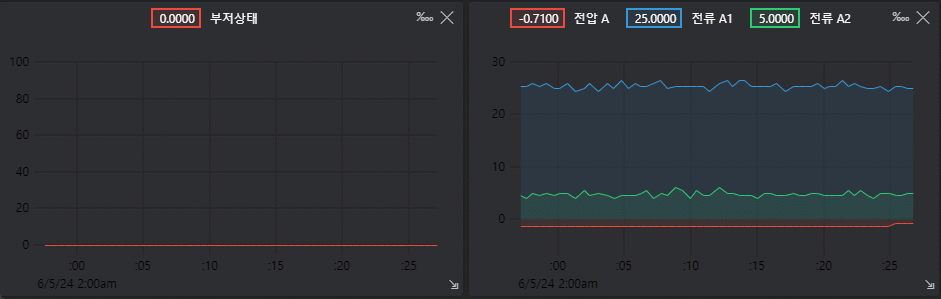
            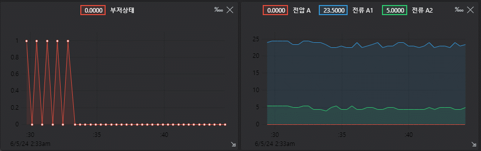
        

    

  

---

        

        

        

        

        

        

        

        

        

    <h1 class="sub4 slowup"  style="--order: 1.2;"> 고찰 및 결론 </h1>
    <ul>
        <li class="slowup" style="--order: 1.7;">연구 결과 분석</li>
        <li class="slowup" style="--order: 2.2;">한계점 및 개선 방안</li>
        <li class="slowup" style="--order: 2.7;">결론</li>
    </ul>

  

---

🔍  고찰 및 결론  🔹 <strong>연구 결과 분석</strong>

<h3 class="slowup" style="--order: 2.2"> 💻 전력 모니터링 기능</h3>

<h4 class="slowup" style="--order: 2.7">실시간 데이터 제공</h4>
<ul>
    <li class="slowup" style="--order: 2.9">디스플레이를 통해
    전력, 전압, 전류  소비량 실시간 시각화</li>
    <li class="slowup" style="--order: 3.1">모바일 및 PC 또한 모니터링 가능</li>
</ul>

<h4 class="slowup" style="--order: 3.6">에너지 사용 관리 기여</h4>
<ul>
    <li class="slowup" style="--order: 3.8">알고리즘으로 전력량 예측 가능</li>
</ul>

    

        

            <h3>전력 모니터링</h3>
        

        

            

                
            

            

                
            

        

    

  

---

🔍  고찰 및 결론  🔹 <strong>연구 결과 분석</strong>

<h3 class="slowup" style="--order: 2.2"> ⚡ 과전류 개별 차단 및 경고 기능</h3>

<h4 class="slowup" style="--order: 2.7">편의성 보장</h4>
<ul>
    <li class="slowup" style="--order: 2.9">총 15A, 개별 8A의 허용 전류</li>
    <li class="slowup" style="--order: 3.1">과전류가 발생한 콘센트만 차단하여  다른 기기 동작에는 영향 최소화</li>
</ul>
<h4 class="slowup" style="--order: 3.6">사고 대응성 강화</h4>
<ul>
    <li class="slowup" style="--order: 3.8">LED를 통한 시각적 경고</li>
    <li class="slowup" style="--order: 4">부저를 통한 청각적 경고</li>
</ul>

    

        

            <h3>과전류 차단</h3>
        

        

            
        

    

  

---

🔍  고찰 및 결론  🔹 <strong>연구 결과 분석</strong>

<h3 class="slowup" style="--order: 2.2"> 🔌  코드 감응형 차단 기능</h3>

<h4 class="slowup" style="--order: 2.7">감전 사고 예방</h4>
<ul>
    <li class="slowup" style="--order: 2.9">플러그 미삽입 시 전류 차단으로 감전 사고 예방</li>
</ul>

<h4 class="slowup" style="--order: 3.4">어린이 안전 강화</h4>
<ul>
    <li class="slowup" style="--order: 3.6">콘센트에 이물질을 삽입해도 전류가 차단된 상태 유지</li>
</ul>

    

        

            <h3>어린이 감전사고 기사</h3>
        

        

            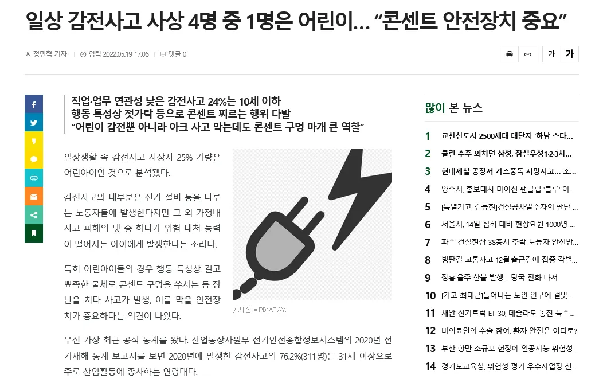
        

    

  

---

🔍  고찰 및 결론  🔹 <strong>한계점 및 개선 방안</strong>

<h4 class="slowup" style="--order: 2.7">하드웨어 크기</h4>
<ul>
    <li class="slowup" style="--order: 2.9">⚠️ 2구 멀티탭이지만 30cm의 큰 크기</li>
    <li class="slowup" style="--order: 3.1">✨ 부품 집적도 개선 & 벽면 매립 </li>
</ul>
<h4 class="slowup" style="--order: 3.6">센서 측정 오차</h4>
<ul>
    <li class="slowup" style="--order: 3.8">⚠️ 전류 100mA & 전압 1~3% 오차 발생</li>
    <li class="slowup" style="--order: 4">✨ 센서 보정 절차 강화 </li>
</ul>

<h4 class="slowup" style="--order: 4.5">차단 시간</h4>
<ul>
    <li class="slowup" style="--order: 4.7">⚠️ 디스플레이 출력 시 차단 시간 [300ms]</li>
    <li class="slowup" style="--order: 4.9">✨ MCU 교체 및 멀티 스레딩 도입 </li>
</ul>

    

        

            <h3>이미지</h3>
        

        

            

                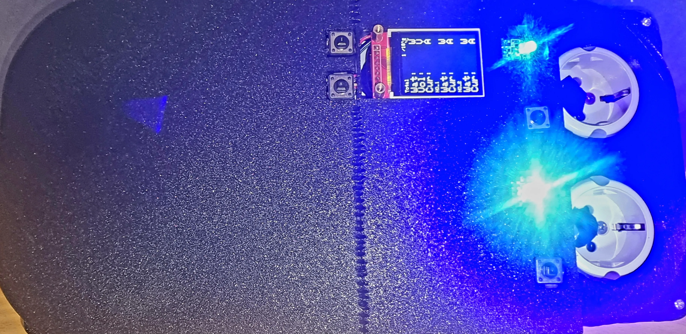
            

            

                
            

            

                
            

            

                
            

            

                
            

        

    

  

---

🔍  고찰 및 결론  🔹 <strong>결론</strong>

    

        <h2 class="slowup" style="--order: 2.2;">📚<strong> 주요 기능</strong></h2>
        <ul>
            <li class="slowup" style="--order: 2.4;">💻전력 모니터링 기능 
            <h5>소비 전력 디스플레이 및 웹 제공 효율적 전기 사용 가이드</h5></li>
            <li class="slowup" style="--order: 2.6;">⚡과전류 개별 차단 및 경고 기능 
            <h5>개별 차단  시/청각적 경고로 즉각 대응</h5></li>
            <li class="slowup" style="--order: 2.8;">🔌코드 감응형 차단 기능 
            <h5>코드 삽입 시 전류 ON 감전 사고 예방</h5></li>
        </ul>
    

    

        <h2 class="slowup" style="--order: 3.5;">📚 기대 효과</h2>
        <ul>
            <li class="slowup" style="--order: 3.7;">감전 사고 예방 및 편의성 증대</li>
            <li class="slowup" style="--order: 3.9;">가정&사무실 전기 사용 환경 개선</li>
        </ul>
        <h2 class="slowup" style="--order: 4.1;">📚 향후 개선 방향</h2>
        <ul>
            <li class="slowup" style="--order: 4.3;">집적도 개선으로 소형화</li>
            <li class="slowup" style="--order: 4.5;">전압&전류 센서 정밀도 향상</li>
            <li class="slowup" style="--order: 4.7;">벽면 매입형 콘센트로 전환 고려</li>
            <li class="slowup" style="--order: 4.9;">멀티스레드 처리로 지연 시간 개선</li>
        </ul>
    

  

---

        

        

        

        

        

        

        

        

        

감사합니다

  

